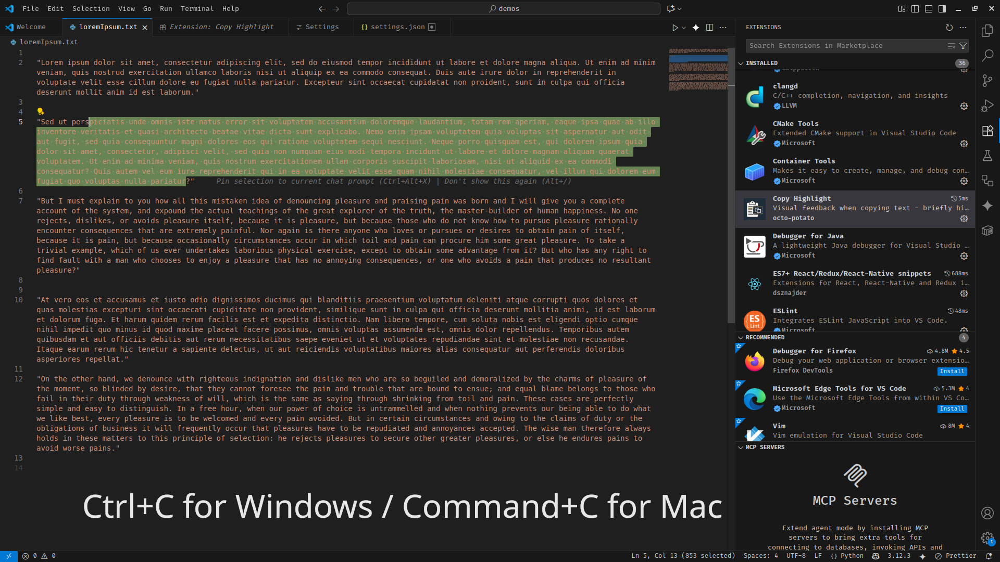

# Copy Highlight

The extension highlights selected text when triggered, making it clear what text is being focused on. Works with copy operations or custom shortcuts.



While it works great with copy operations, you can configure any custom keyboard shortcut to trigger the highlight effect (see [Custom Keyboard Shortcuts](#custom-keyboard-shortcuts)).

## Features

-   **Visual Feedback**: Highlights selected text with copy shortcut or any customizable keyboard shortcuts
-   **Copy Integration**: Works seamlessly with standard copy operations Ctrl+C (Cmd+C for mac)
-   **Custom Shortcuts**: Configure any keyboard shortcut to trigger highlighting
-   **Customizable Highlighting**: Configure background color, transparency, and duration
-   **Non-intrusive**: Highlight automatically disappears after a configurable duration
-   **Flexible Usage**: Use with copy operations or as a standalone text highlighter

## Requirements

-   VS Code 1.60.0 or higher

## Extension Settings

This extension contributes the following settings:

-   `copyHighlight.backgroundColor`: Background color for copy highlighting (hex color, default: `#ffff00`)
-   `copyHighlight.transparency`: Transparency level for copy highlighting (0-1, default: `0.3`)
-   `copyHighlight.duration`: Duration in milliseconds to show the highlight (100-5000ms, default: `200`)

## Usage

### Default Copy Highlighting

1. Select any text in the editor
2. Press `Ctrl+C` (or `Cmd+C` on Mac) to copy
3. The selected text will briefly highlight to confirm the copy operation

### Custom Keyboard Shortcuts

You can configure any keyboard shortcut to trigger the highlight effect:

1. Open VS Code Command Palette (`Ctrl+Shift+P` or `Cmd+Shift+P`)
2. Type "Preferences: Open Keyboard Shortcuts (JSON)"
3. Add your custom keybinding:

```json
{
    "key": "ctrl+shift+I",
    "command": "copyHighlight.highlight",
    "when": "editorTextFocus"
}
```

Replace `ctrl+shift+I` with your preferred key combination. Now you can highlight selected text anytime without copying!

## Configuration

### Appearance Settings

You can customize the highlight appearance by modifying these settings in your VS Code settings:

```json
{
    "copyHighlight.backgroundColor": "#00ff00",
    "copyHighlight.transparency": 0.5,
    "copyHighlight.duration": 300
}
```

### Custom Keyboard Shortcuts

Configure your own shortcuts to trigger highlighting without copying:

**Method 1: Via Command Palette**

1. Open Command Palette (`Ctrl+Shift+P`)
2. Type "Preferences: Open Keyboard Shortcuts"
3. Search for "copyHighlight.highlight"
4. Right click on the line related to "copyHighlight.highlight" and select "Add keybinding"
5. Enter your custom keybinding

**Method 2: Via JSON Configuration**

1. Open Command Palette and select "Preferences: Open Keyboard Shortcuts (JSON)"
2. Add your custom keybinding:

```json
[
    {
        "key": "ctrl+alt+h",
        "command": "copyHighlight.highlight",
        "when": "editorTextFocus"
    },
    {
        "key": "f9",
        "command": "copyHighlight.highlight",
        "when": "editorTextFocus"
    }
]
```

Choose any key combination that works best for your workflow!

## Known Issues and Repo

Repository and code for extension can be seen here [Repo](https://github.com/aryatsriv/vscode-copy-highlight)

Please report any issues on [Known Issue](https://github.com/aryatsriv/vscode-copy-highlight/issues)

## Release Notes

### 1.1.2

-   **Screenshot added**: Screenshot added for better clarity

### 1.1.1

-   **Smart Line Highlighting**: Extension now highlights entire lines when copying without text selection
-   **Enhanced User Experience**: Works seamlessly whether you select text or just position cursor on a line

**Enjoy!**
